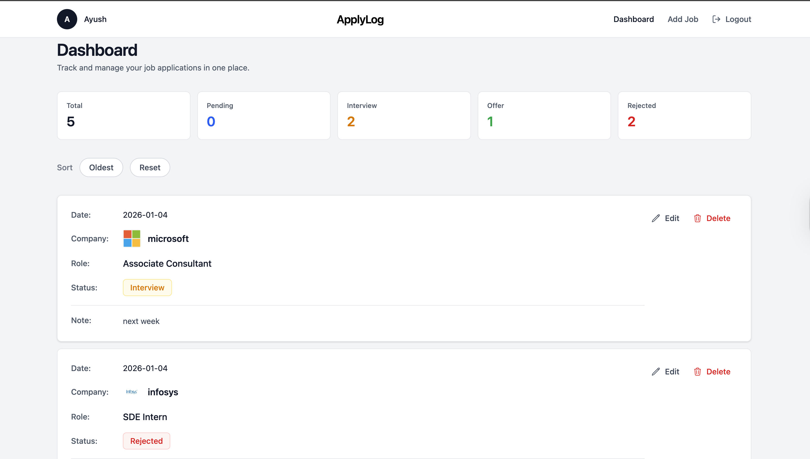
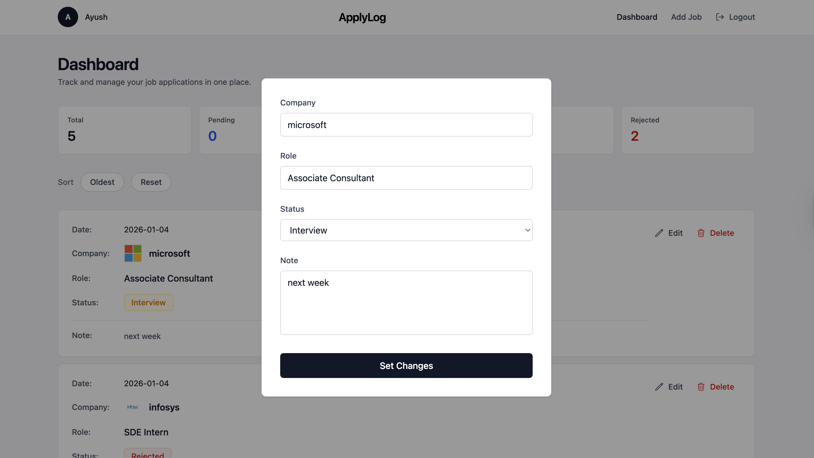

# ApplyLog – Job Application Tracker

A modern job application tracking dashboard designed to manage, organize, and persist job applications with a clean, scalable frontend architecture.

This project focuses on **real-world frontend engineering patterns** such as global state management, protected routing, controlled forms, client-side persistence, and modular UI composition — not just UI rendering.

---

## 📸 Screenshots

### Dashboard

### Edit Job (Modal)

---

## ✨ Features

### 🔐 Authentication (Fake Auth)
- Login & logout flow
- User-scoped session persistence using `localStorage`
- Protected routes to prevent unauthorized access
- Automatic session hydration on refresh

### 📋 Job Management
- Add job applications with:
  - Company
  - Role
  - Status (Applied, Interview, Offer, Rejected)
  - Notes
  - Applied date
- Edit applications using modal overlays
- Delete applications with confirmation feedback
- User-specific job isolation (per account)
- Immutable state updates for reliability

### 🔍 Sorting & Filtering
- Filter applications by status
- Sort applications by applied date
- Reset sorting without mutating persisted data

### 🎨 UI / UX
- Clean, minimal light-themed interface
- Card-based dashboard layout
- Modal-based focused interactions
- Toast notifications for user actions
- Responsive design with Tailwind CSS

### 💾 Data Persistence
- Jobs stored per user in `localStorage`
- Predictable state hydration on reload
- Centralized state using React Context

---

## 🧠 Core Concepts & Skills Demonstrated

- React Context API for global state management
- Custom hooks for reusable business logic
- Controlled forms & predictable state modeling
- Route protection & navigation flow
- Client-side persistence with `localStorage`
- Immutable state updates
- Modal rendering with `createPortal`
- Conditional rendering & UI state control
- Separation of concerns (Layout / Pages / Components)
- Scalable component structure (App Shell pattern)

---

## 🛠 Tech Stack

- React.js
- React Router
- Tailwind CSS
- JavaScript (ES6+)
- HTML5
- CSS3

---

## 📂 Project Structure (Simplified)

src/
│── components/
│   ├── Dashboard/
│   ├── AddJobs/
│   ├── EditModals/
│   ├── Header/
│   ├── Footer/
│── Context/
│   ├── AuthContext.jsx
│   ├── JobContext.jsx
│   ├── ToastProvider.jsx
│── LogoCustomHook/
│── Layout.jsx
│── App.jsx
│── main.jsx

---

## 🎯 Why This Project Matters

This project goes beyond basic CRUD demos by emphasizing:

- Clear state ownership
- User-scoped data persistence
- Guarded routes & session handling
- UI consistency through a centralized layout
- Reusable logic via custom hooks
- Patterns commonly used in internal tools and SaaS dashboards

It mirrors how **real-world dashboards and internal products** are structured in engineering teams.

---

## 🚀 Future Enhancements

- Backend integration (Node.js + database)
- Real authentication providers
- Server-side persistence
- Advanced analytics & insights
- Search across applications
- Pagination & performance optimizations

---

## 👤 Author

**Ramu Battula**  
B.Tech Computer Science & Engineering  

📧 Email: ramu49052@gmail.com  

🔗 LinkedIn: https://www.linkedin.com/in/ramubattula/

Focused on building **scalable, maintainable, real-world applications** with strong fundamentals in frontend and backend development.
